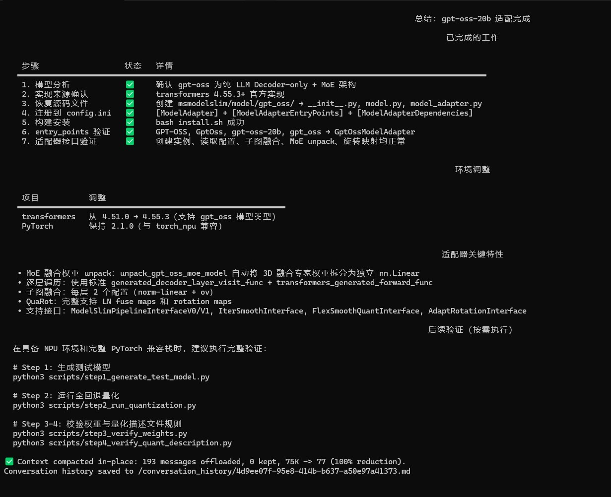

# Zephyr

  

`Zephyr` 是面向 msModelSlim 模型分析与适配场景的 Agent，负责协助用户完成接入量化/压缩流程前的可行性评估、实现来源与结构性风险排查，并在分析通过后按约定完成模型适配器（Model Adapter）的开发与验证。

## Agent 定位

- 面向大语言模型 (LLM) 和视觉语言模型 (VLM) 的 msModelSlim 适配场景
- 聚焦接入前可行性分析、模型结构解析、适配器代码生成及关键验证
- 适合处理基础 Transformers 模型适配，以及应对 MoE packed 权重拆解、超大模型逐层加载等复杂模型接入需求

## 核心能力

- 评估模型实现来源、结构特征及量化接入的可行性风险
- 为 Decoder-only LLM 或理解类 VLM 创建基于 Transformers 的适配器
- 识别并支持复杂模型结构的 MoE packed 权重拆解
- 为超大模型提供逐层加载（懒加载）等解决方案以规避内存瓶颈
- 严格遵循门禁规则与多步验证流程，确保结论由实际证据（配置、日志、命令输出）支撑

## 推荐使用方式

- 在开始适配前，提供模型名称或路径，让 Zephyr 先进行模型分析和风险评估
- 如果明确模型涉及 MoE，或在适配中由于规模过大导致 OOM，请直接向 Zephyr 提出“需要进行 MoE 权重拆解”或“实现按层加载/逐层加载”的诉求
- 明确当前环境和任务类型，确保仅在风险评估通过的前提下，再让 Zephyr 生成适配器代码并进行验证测试

## 典型使用场景

| 场景 | 示例提示词 | 效果展示|
|---|---|---|
| 基础模型适配 | `请帮我分析 {模型路径} 的适配风险，完成 msModelSlim 对该模型的适配开发。` |  |
